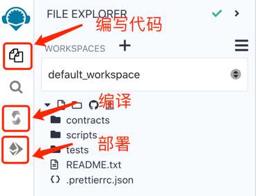
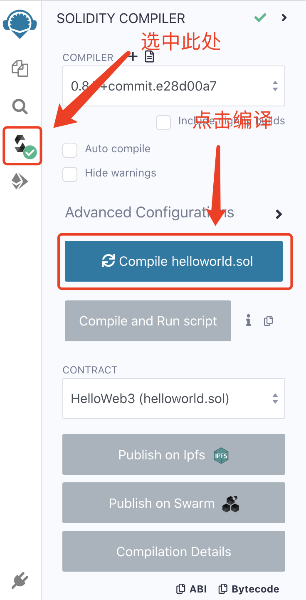
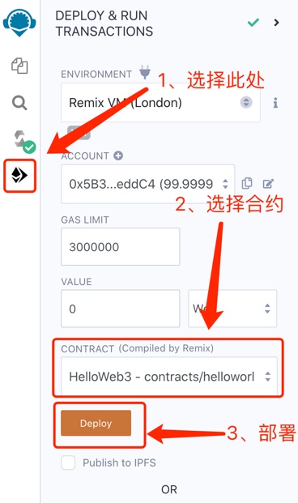
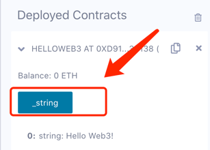

# Remix

`Remix`是智能合约众多开发工具中比较好用的一个，是官方推荐的IDE，Remix可以在浏览器中运行开发部署，非常适合新手。
网址：[remix.ethereum.org](https://remix.ethereum.org)

## Remix 开发工具功能介绍



上方的图片就是Remix IDE，图中有`编写`、`编译`、`部署`的功能

## Hello World

```solidity
// SPDX-License-Identifier: MIT
pragma solidity ^0.8.4;
contract HelloWorld{
    string public _string = "Hello World!";
}
```

*编写*

`Solidity`文件结构

1. 注释 声明开源协议。

```
// SPDX-License-Identifier: MIT
```

2. 版本 声明`Solidity`版本，涉及到不同版本的语法、编译等问题。

```
pragma solidity ^0.8.4;
```

3. 合约内容 创建合约`contract`，并声明合约的名字 HelloWorld。我们声明了一个`string`（字符串）变量`_string`，并给他赋值 “Hello
   World!”。

```
contract HelloWorld{
  string public _string = "Hello World!";
}
```  

*编译*



*部署*



*调用*



点击上方图片中的`_string`可以查看预留在合约中的`_string`变量值。

## 总结
此处我们讲了`RemixIDE`的基本使用，并编写、编译、部署了第一个`Solidity`的`HelloWorld`智能合约。


